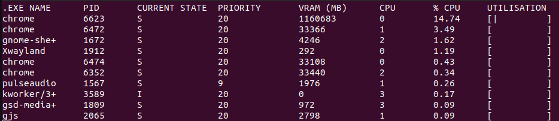

# Linux Process Monitor

## About
This repository contains a process monitor written in C for Linux. For each process, it tracks relevant statistics including CPU utilisation, process priority, state, and VRAM usage.

## How to use

1. Clone the repository using `git clone https://github.com/elliottcoops/Linux-Process-Monitor.git`
2. Install [gcc compiler](https://gcc.gnu.org/install/) if you don't have one
3. Navigate to the `Linux-Process-Monitor` directory
4. Compile code using `gcc code/*.c -o <exe_filename>` 
5. Run using `./<exe_filename>`

## Pipeline

Linux has a special directory called `/proc`, which you can't access but can examine. The directory holds details about your Linux system, including its kernel, processes and configuration parameters. 

### Getting current processes (`sys_file_handler.c`)

To retrieve all current running processes, we iterate through the `/proc` directory and extract the process IDs (PIDs) from the folder names.

For each PID, we can access individual statistics from `/proc/<pid>/stat`.

These statistics are stored in a `ProcessData` structure, which helps keep track of the current readings.

To manage all `ProcessData` structures, we use a linked list-like data structure called `DataNode` to chain together each process.

### Sorting (`sort.c`)

Since there are many processes, it's better to focus on those that have run most recently. We can sort them by their recent CPU utilisation over a specified time period.

The `/proc/stats` directory holds the total CPU uptime. To get a time period, we record the uptime, put the process monitor to sleep for `WAIT_TIME` microseconds, and then calculate the time deltas for both the CPU and each process. CPU utilisation is calculated as `process_time_delta / cpu_time_delta`.

Once each process's CPU utilisation is determined, we use a merge sort implementation to sort them by their CPU utilisation.

### Displaying (`display.c`)

The top `MAX_TRACKING` processes are displayed in a terminal UI, with each column representing a different statistic and each row corresponding to a different process.
